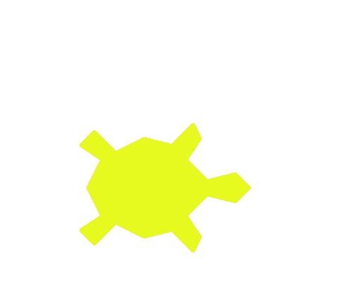

# Logical Turtle

In this lesson we will maje the turtle move to where we click on the screen and if we click on the turtle itself it will spin and change colors!

# Assignment

Read each of  the comments in the code carefully for instructions. 

<iframe width="100%" height="600" src="https://trinket.io/tools/1.0/jekyll/embed/python#code=import%20random%0Aimport%20turtle%20as%20turtle%0A%0A%23%20Returns%20a%20random%20color%21%0Adef%20getRandomColor%28%29%3A%0A%20%20%20%20return%20%22%23%2506X%22%20%25%20%28random.randint%280%2C%200xFFFFFF%29%29%0A%0A%23%20%3D%3D%3D%3D%3D%3D%3D%3D%3D%3D%3D%3D%3D%3D%3D%3D%3D%3D%3D%3D%3D%3D%20DO%20NOT%20EDIT%20THE%20CODE%20ABOVE%20%3D%3D%3D%3D%3D%3D%3D%3D%3D%3D%3D%3D%3D%3D%3D%3D%3D%3D%3D%3D%3D%3D%3D%3D%3D%3D%3D%0A%0Adef%20screenClicked%28x%2C%20y%29%3A%0A%20%20%20%20print%28%27You%20pressed%3A%20x%3D%27%20%2B%20str%28x%29%20%2B%20%27%2C%20y%3D%27%20%2B%20str%28y%29%29%0A%20%20%20%20myTurtle.penup%28%29%0A%20%20%20%20%0A%20%20%20%20%23%204.%20Move%20the%20turtle%20to%20a%20new%20location%20using%20.goto%28x%2C%20y%29%0A%20%20%20%20myTurtle.goto%28x%2C%20y%29%20%20%23%20%3B%0A%0Adef%20turtleClicked%28x%2C%20y%29%3A%0A%20%20%20%20print%28%27turtle%20clicked%21%27%29%20%20%23%20%3B%0A%20%20%20%20%0A%20%20%20%20%23%20Make%20a%20for%20loop%20to%20run%20the%20next%20instructions%203%20times%0A%20%20%20%20for%20i%20in%20range%283%29%3A%20%20%23%20%3B%0A%20%20%20%20%20%20%20%20%0A%20%20%20%20%20%20%20%20%23%20Make%20the%20turtle%20spin%20using%20the%20.right%28%29%20function%0A%20%20%20%20%20%20%20%20myTurtle.right%28360%29%20%20%23%20%3B%0A%20%20%20%20%20%20%20%20%0A%20%20%20%20%20%20%20%20%23%20Use%20the%20.color%28%29%20and%20getRandomColor%28%29%20functions%20to%20change%20the%20color%20of%20the%20turtle%0A%20%20%20%20%20%20%20%20myTurtle.color%28getRandomColor%28%29%29%20%20%23%20%3B%0A%0A%0Awindow%20%3D%20turtle.Screen%28%29%20%20%23%20%3B%0Awindow.setup%28width%3D0.75%2C%20height%3D0.8%2C%20startx%3D0%2C%20starty%3D0%29%20%20%23%20%3B%0A%0A%23%20Make%20a%20new%20turtle%0AmyTurtle%20%3D%20turtle.Turtle%28%29%20%20%23%20%3B%0A%0A%23%20Make%20your%20turtle%27s%20shape%20%27turtle%27%2C%20.shape%28%27turtle%27%29%0AmyTurtle.shape%28%27turtle%27%29%20%20%23%20%3B%0A%0A%23%20Set%20your%20turtle%27s%20color%20using%20.color%28%27green%27%29%20and%20.pencolor%28%27blue%27%29%0AmyTurtle.color%28%27green%27%29%20%20%23%20%3B%0AmyTurtle.pencolor%28%27blue%27%29%20%20%23%20%3B%0A%0A%23%20Set%20and%20new%20width%2C%20length%2C%20and%20outline%20of%20our%20turtle%0AmyTurtle.turtlesize%28stretch_wid%3D10%2C%20stretch_len%3D10%2C%20outline%3D4%29%20%20%23%20%3B%0A%0A%23%20%3D%3D%3D%3D%3D%3D%3D%3D%3D%3D%3D%3D%3D%3D%3D%3D%3D%3D%3D%3D%3D%20DO%20NOT%20EDIT%20THE%20CODE%20BELOW%20%3D%3D%3D%3D%3D%3D%3D%3D%3D%3D%3D%3D%3D%3D%3D%3D%3D%3D%3D%3D%3D%3D%3D%3D%3D%3D%3D%3D%0Awindow.onclick%28screenClicked%29%0AmyTurtle.onclick%28turtleClicked%29%0Aturtle.done%28%29" frameborder="0" marginwidth="0" marginheight="0" allowfullscreen></iframe>

Have fun!
