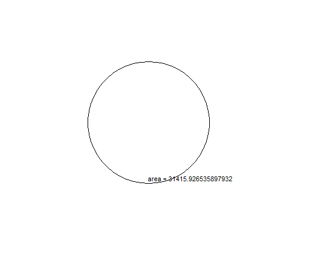

# Circle Area Calculator

In this lesson we will get a pop up asking for a radius, then a turtle will draw a circle with that radius in pixels and display the area of the circle.

# Assignment

Read each of  the comments in the code carefully for instructions. 

<iframe width="100%" height="600" src="https://trinket.io/tools/1.0/jekyll/embed/python#code=import%20turtle%0Afrom%20tkinter%20import%20messagebox%2C%20simpledialog%2C%20Tk%0Aimport%20math%0A%0Awindow%20%3D%20Tk%28%29%0Awindow.withdraw%28%29%0A%0A%23%20Ask%20the%20user%20for%20the%20radius%20in%20pixels%20and%20store%20it%20in%20a%20variable%0A%23%20simpledialog.askinteger%28None%2C%20%22enter%20a%20radius%22%29%0Aradius%20%3D%20simpledialog.askinteger%28None%2C%20%22enter%20a%20radius%22%29%20%20%23%20%3B%0A%0A%23%20Make%20a%20new%20turtle%0Amy_turtle%20%3D%20turtle.Turtle%28%29%20%20%23%20%3B%0A%0A%23%20Have%20your%20turtle%20draw%20a%20circle%20with%20the%20correct%20radius%0A%23%20my_turtle.circle%28%29%0Amy_turtle.circle%28radius%3Dradius%2C%20extent%3D360%2C%20steps%3D50%29%20%20%23%20%3B%0A%0A%23%20Call%20the%20turtle%20.penup%28%29%20method%0Amy_turtle.penup%28%29%20%20%23%20%3B%0A%0A%23%20Move%20your%20turtle%20to%20a%20new%20x%2Cy%20position%20using%20.goto%28%29%0Amy_turtle.goto%280%2C%200%29%20%20%23%20%3B%0A%0A%23%20Calculate%20the%20area%20of%20your%20circle%20and%20store%20it%20in%20a%20variable%2C%20you%20can%20use%20math.pi%0Aarea%20%3D%20math.pi%20%2A%20radius%20%2A%20radius%20%20%23%20%3B%0A%0A%23%20Write%20the%20area%20of%20your%20circle%20using%20the%20turtle%20.write%28%29%20method%0A%23%20my_turtle.write%28arg%3D%22area%20%3D%20%22%20%2B%20str%28area%29%2C%20move%3DTrue%2C%20align%3D%27left%27%2C%20font%3D%28%27Arial%27%2C8%2C%27normal%27%29%29%0Amy_turtle.write%28%20%20%23%20%3B%0A%20%20%20%20arg%3D%22area%20%3D%20%22%20%2B%20str%28area%29%2C%20move%3DTrue%2C%20align%3D%22left%22%2C%20font%3D%28%22Arial%22%2C%208%2C%20%22normal%22%29%20%20%23%20%3B%0A%29%20%20%23%20%3B%0A%0A%23%20Hide%20your%20turtle%0Amy_turtle.hideturtle%28%29%20%20%23%20%3B%0A%0A%23%20Call%20turtle.done%28%29%0Aturtle.done%28%29%20%20%23%20%3B%0Awindow.mainloop%28%29" frameborder="0" marginwidth="0" marginheight="0" allowfullscreen></iframe>

Have fun!
